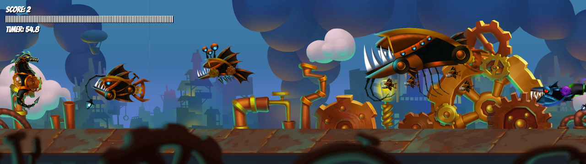

# Steampocalypse

## Introduction

This is a simple steampunk theme based shooter game built using HTML, CSS, and JavaScript. It features a player-controlled character, various enemies, power-up, and shooting mechanics.

## Features

- Player-controlled character movement using arrow keys (up and down).
- Shooting mechanism using the space bar key.
- Dynamically generated enemies with variety of skills.
- Power-up that enhance player shooting ability.
- Debug mode to toggle debugging features.
- Restart option available after game over (press 'R' key).

## How to Play

1. Navigate [here](https://sarmaakondi.github.io/project-1-steampocalypse/)
2. Hover over the instructions, read and click "PLAY"
3. Use the arrow keys (up and down) to move the player.
4. Press the space bar to shoot at enemies.
5. Collide with small fish glowing in yellow color for powerup.
6. Collect power-up to enhance your shooting ability and ammo.
7. Press 'R' to restart the game after game over.

## In-Game Screenshot

## Credits

Thanks a ton to [bevouliin](https://bevouliin.com/category/free_game_asset/) and [opengameart](https://opengameart.org/) for providing free game assets. Please buy and support them if you like their wonderful game assets.
